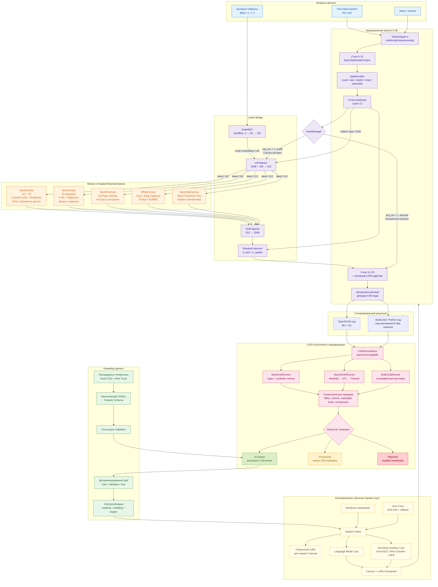
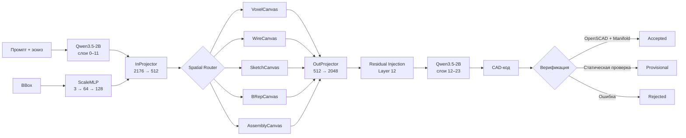

# OmniCraft-LM — архитектура

## Полная архитектурная схема

```mermaid
flowchart TB
    subgraph INPUT["Входные данные"]
        PROMPT["Текстовый промпт<br/>RU / EN"]
        IMAGE["Эскиз / чертёж"]
        BBOX["Целевые габариты<br/>BBox: X, Y, Z"]
    end

    subgraph BACKBONE["Замороженный Qwen3.5-2B"]
        TOKENIZER["Токенизация и<br/>multimodal preprocessing"]
        LAYERS_A["Слои 0–11<br/>Early Multimodal Fusion"]
        ROUTER["Spatial token<br/>voxel / wire / sketch / brep / assembly"]
        LAYER_12["Точка инжекции<br/>Layer 12"]
        LAYERS_B["Слои 12–23<br/>+ активный LoRA-адаптер"]
        DECODER["Авторегрессионный<br/>декодер CAD-кода"]
    end

    PROMPT --> TOKENIZER
    IMAGE --> TOKENIZER
    TOKENIZER --> LAYERS_A
    LAYERS_A --> ROUTER
    ROUTER --> LAYER_12

    subgraph BRIDGE["Latent Bridge"]
        SCALE["ScaleMLP<br/>log BBox: 3 → 64 → 128"]
        INPROJ["InProjector<br/>2048 + 128 → 512"]
        OUTPROJ["OutProjector<br/>512 → 2048"]
        RESIDUAL["Residual Injection<br/>h_mid + h_spatial"]
    end

    BBOX --> SCALE
    LAYER_12 -->|"hidden state: 2048"| INPROJ
    SCALE -->|"scale embedding: 128"| INPROJ

    subgraph MOSR["Mixture of Spatial Representations"]
        direction LR
        VOXEL["VoxelCanvas<br/>16³ × 32<br/>CoordConv3D + ResBlocks<br/>CSG и объёмные детали"]
        WIRE["WireCanvas<br/>32 вершины<br/>k-NN + EdgeConv<br/>фермы и каркасы"]
        SKETCH["SketchCanvas<br/>2D Plane ResNet<br/>контуры и экструзии"]
        BREP["BRepCanvas<br/>Face / Edge Features<br/>B-Rep и NURBS"]
        ASSEMBLY["AssemblyCanvas<br/>SE(3) Transform Tree<br/>сборки и кинематика"]
    end

    INPROJ -->|"latent: 512"| VOXEL
    INPROJ -->|"latent: 512"| WIRE
    INPROJ -->|"latent: 512"| SKETCH
    INPROJ -->|"latent: 512"| BREP
    INPROJ -->|"latent: 512"| ASSEMBLY

    VOXEL --> OUTPROJ
    WIRE --> OUTPROJ
    SKETCH --> OUTPROJ
    BREP --> OUTPROJ
    ASSEMBLY --> OUTPROJ

    OUTPROJ --> RESIDUAL
    LAYER_12 --> RESIDUAL
    RESIDUAL --> LAYERS_B
    LAYERS_B --> DECODER

    HOOK{"HookManager"}
    LAYER_12 --> HOOK
    HOOK -->|"seq_len > 1: prefill<br/>Canvas активен"| INPROJ
    HOOK -->|"seq_len = 1: decode<br/>прозрачный пропуск"| LAYERS_B

    subgraph OUTPUT["Сгенерированный результат"]
        SCAD["OpenSCAD-код<br/>$fn = 32;"]
        BUILD["Build123d / Python-код<br/>перспективный B-Rep backend"]
    end

    DECODER --> SCAD
    DECODER --> BUILD

    subgraph CADENV["CAD Environment и верификация"]
        INTERFACE["CADRunnerBase<br/>единый интерфейс"]
        MOCK["MockCADRunner<br/>regex + synthetic metrics"]
        OPENSCAD["OpenSCADRunner<br/>Manifold → STL → Trimesh"]
        B123D["Build123dRunner<br/>интерфейсная заготовка"]
        METRICS["Геометрические проверки<br/>BBox, volume, watertight,<br/>Euler, components"]
        VERDICT{"Результат проверки"}
        ACCEPTED["Accepted<br/>допущено к обучению"]
        PROVISIONAL["Provisional<br/>нужна CAD-проверка"]
        REJECTED["Rejected<br/>ошибка геометрии"]
    end

    SCAD --> INTERFACE
    BUILD --> INTERFACE
    INTERFACE --> MOCK
    INTERFACE --> OPENSCAD
    INTERFACE --> B123D
    MOCK --> METRICS
    OPENSCAD --> METRICS
    B123D --> METRICS
    METRICS --> VERDICT
    VERDICT --> ACCEPTED
    VERDICT --> PROVISIONAL
    VERDICT --> REJECTED

    subgraph DATA["Конвейер данных"]
        GENERATORS["Процедурные генераторы<br/>Voxel CSG + Wire Truss"]
        JSONL["Канонический JSONL<br/>Pydantic Schema"]
        VALIDATOR["Trust-aware Validation"]
        SPLIT["Детерминированный split<br/>train / validation / test"]
        DATASET["CADJsonlDataset<br/>masking + padding + targets"]
    end

    GENERATORS --> JSONL
    JSONL --> VALIDATOR
    VALIDATOR --> ACCEPTED
    ACCEPTED --> SPLIT
    SPLIT --> DATASET

    subgraph TRAINING["Изолированное обучение Spatial Layer"]
        TRAINER["Spatial Trainer"]
        FREEZE["Backbone заморожен"]
        LORA["Отдельный LoRA<br/>для каждого Canvas"]
        LMLOSS["Language Model Loss"]
        AUXLOSS["Geometry Auxiliary Loss<br/>Voxel BCE / Wire Chamfer + BCE"]
        CHECKPOINT["Canvas + LoRA Checkpoint"]
        ZERO["Zero Point<br/>SHA-256 + rollback"]
    end

    DATASET --> TRAINER
    FREEZE --> TRAINER
    TRAINER --> LORA
    TRAINER --> LMLOSS
    TRAINER --> AUXLOSS
    LMLOSS --> CHECKPOINT
    AUXLOSS --> CHECKPOINT
    ZERO --> TRAINER
    CHECKPOINT --> BACKBONE

    classDef input fill:#e3f2fd,stroke:#1565c0,color:#0d47a1
    classDef model fill:#ede7f6,stroke:#5e35b1,color:#311b92
    classDef canvas fill:#fff3e0,stroke:#ef6c00,color:#e65100
    classDef data fill:#e8f5e9,stroke:#2e7d32,color:#1b5e20
    classDef cad fill:#fce4ec,stroke:#c2185b,color:#880e4f
    classDef training fill:#fffde7,stroke:#f9a825,color:#5d4037
    classDef success fill:#dcedc8,stroke:#558b2f,color:#33691e
    classDef warning fill:#fff3cd,stroke:#ff8f00,color:#7f6000
    classDef error fill:#ffcdd2,stroke:#c62828,color:#7f0000

    class PROMPT,IMAGE,BBOX input
    class TOKENIZER,LAYERS_A,ROUTER,LAYER_12,LAYERS_B,DECODER,SCALE,INPROJ,OUTPROJ,RESIDUAL,HOOK model
    class VOXEL,WIRE,SKETCH,BREP,ASSEMBLY canvas
    class GENERATORS,JSONL,VALIDATOR,SPLIT,DATASET data
    class INTERFACE,MOCK,OPENSCAD,B123D,METRICS,VERDICT cad
    class TRAINER,FREEZE,LORA,LMLOSS,AUXLOSS,CHECKPOINT,ZERO training
    class ACCEPTED success
    class PROVISIONAL warning
    class REJECTED error
```

## Упрощённый основной поток

```mermaid
flowchart LR
    A["Промпт + эскиз"] --> B["Qwen3.5-2B<br/>слои 0–11"]
    S["BBox"] --> M["ScaleMLP<br/>3 → 64 → 128"]

    B --> I["InProjector<br/>2176 → 512"]
    M --> I
    I --> R{"Spatial Router"}

    R --> V["VoxelCanvas"]
    R --> W["WireCanvas"]
    R --> K["SketchCanvas"]
    R --> P["BRepCanvas"]
    R --> Y["AssemblyCanvas"]

    V --> O["OutProjector<br/>512 → 2048"]
    W --> O
    K --> O
    P --> O
    Y --> O

    O --> Q["Residual Injection<br/>Layer 12"]
    Q --> C["Qwen3.5-2B<br/>слои 12–23"]
    C --> D["CAD-код"]

    D --> E{"Верификация"}
    E -->|"OpenSCAD + Manifold"| F["Accepted"]
    E -->|"Статическая проверка"| G["Provisional"]
    E -->|"Ошибка"| H["Rejected"]
```
